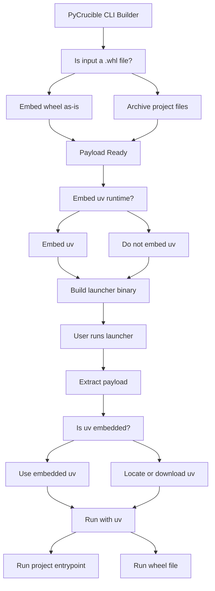

## Sections
- [What is PyCrucible?](#what-is-pycrucible)
- [Quickstart](#quickstart)
- [Installation](#how-to-install-pycrucible)
- [Usage](#how-to-use-pycrucible)
- [Runtime Configuration](#pycrucible-configuration)
- [Embedding Options](#more-pycrucible-options)
- [Github Action](#github-action)
- [Security](#security--code-signing)
- [How it works](#how-pycrucible-works---a-diagram)
- [Features](#features)
- [Community](#community)
- [Changelog](#changelog)
- [Thanks to](#thanks-to)

## What is PyCrucible?
PyCrucible packages any Python project into a single **cross-platform** executable with **minimal overhead**, powered by *Rust and uv*.

Existing tools like `PyInstaller` bundle the entire Python interpreter, dependencies, and project files. This typically results in:
- large binaries
- slow builds
- dependency complexity
- fragile runtime environments

#### PyCrucible is diffrent
- Fast and robust — written in Rust
- Multi-platform — Windows, Linux, macOS
- Tiny executables — ~2MB + your project files (if using `--no-uv-embed` flag [added: *v0.4.0*])
- Support for `*.whl` embedding [added: *v0.4.0*]
- Hassle-free dependency resolution — delegated to uv
- Simple but configurable
- Supports auto-updates (GitHub public repos)
- Includes a GitHub Action for CI automation

> [!NOTE]
> On the first run, PyCrucible downloads project dependencies through uv.
>
> Subsequent runs start instantly.

## Quickstart
If you dont want to read the specifics, jump right in. Its easy to use:
```bash
pip install pycrucible
pycrucible -e . -o ./myapp
```

## How to install `PyCrucible`
There are a couple of ways to install PyCrucible.
- using `PyPi`
- downloading from Github Releases
- compiling source code

### Using `PyPi`
PyCrucible is published to `PyPi` for every release. All you need to do is:
```bash
pip install pycrucible
```

> [!TIP]
> You can also use `pipx`, `uv` or `uvx` to download and install PyCrucible from `PyPi`.

> [!NOTE]
> PyCrucible on `PyPi` is compiled with `glibc==2.28` making sure its compatible with older operating systems.

### Using `Github Releases`
You can download pre-made binaries for your system from 

[Github Releases](https://github.com/razorblade23/PyCrucible/releases/latest)

### Downloading and building from source code
1. Ensure you have [Rust](https://www.rust-lang.org/) installed.

2. Clone the repository
- ```git clone https://github.com/razorblade23/PyCrucible```

3. Change directory to be inside of a project
- ```cd PyCrucible```

4. Build Runner
- ```cargo build -p pycrucible_runner --release```

5. Build Pycrucible
- ```cargo build -p pycrucible --release```

> [!NOTE]
> The resulting binary will be in `target/release/pycrucible`.

## How to use `PyCrucible`
All you need for starting is a single `main.py` file with some code.
#### Documentation
Documentation can be found at [PyCrucible docs](https://pycrucible.razorblade23.dev).

#### Example project
This is our example project.

```python
def main():
    print("Hello from PyCrucible binary")

if __name__ == "__main__":
    main()
```
> [!IMPORTANT]
> PyCrucible defaults to `src/main.py` so that is how you should save your file, but you can override this with **entrypoint** configuration.

> [!TIP]
> It would also be nice if you had `pyproject.toml` file, but this is not a requirement. If you do use configuration file, setting **entrypoint** directive is required.
>
> Example `pyproject.toml`
> ```toml
> [project]
> name = "pycrucible-example"
> version = "0.1.0"
> description = "Simple example in using PyCrucible"
> requires-python = ">=3.12"
> dependencies = []
> 
> [tool.pycrucible]
> entrypoint = "main.py"
> ```

Now that we have our ingredients, lets make a binary using PyCrucible.
```bash
$ pycrucible -e .
```

This will embed your project and produce a new binary which is by default called `launcher` (or `launcher.exe` on Windows).

> [!TIP]
> To configure the output path and name of your binary, use `-o` or `--output` flag.
>
> Example: `pycrucible -e . -o ./myapp` (or `pycrucible -e . -o ./myapp.exe`)

This is now **all you need** to distribute your python project to other people.
**No python required on their end. Just this single binary.**

## It does not have to be a .py script
In web apps it is common to run some server that will handle your requests. In PyCrucible, `entrypoint`, `pre-run` or `post-run` do not need to be .py scripts.

You can use anything from your dependacies as a starting point. For example, you could run your flask application like this:
```toml
# pyproject.toml
...

[tool.pycrucible]
entrypoint = "gunicorn --port 9000 --host '0.0.0.0' app.app"
```
Everything that you pass as `entrypoint`, `pre-run` or `post-run` will be used just like you would run those commands within your enviroment.

## PyCrucible configuration
Configuration can be set in any of these files:
- `pycrucible.toml`
- `pyproject.toml`

> [!IMPORTANT]
> When using any configuration option, only `entrypoint` (or `entry`) is required. Other options are optional.

Supported configuration options are:
- entrypoint (entry) - The main file your application must run. Usually `main.py` or `app.py`.
- options
    - debug - Enable debug output during runtime of binary. Used for debugging.
    - extract_to_temp - Extract the project files to temporary directory instead of directory next to binary.
    - delete_after_run - Delete source files after running.
- patterns
    - include - What files to include into your final binary.
    - exclude - What files to exclude from your final binary.
- env - key-value pairs of enviroment variables that will be set before running your binary.
- hooks
    - pre-run - Run this script before running main application. Useful for pre-loading of data. Must be Python script.
    - post-run - Run this script after running main application. Useful for unloading of data. Must be Python script.

> [!NOTE]
> When both `pycrucible.toml` and `pyproject.toml` are discovered, configuration from `pycrucible.toml` will take effect.

**Both of these files have exact same configuration options**

You can find **example configuration file for `pycrucible.toml`** [here](pycrucible.example.toml)

Only diffrence between these files is that **`pyproject.toml`** requires you to **prefix** pycrucible configuration with **`tool.pycrucible<.section>`**.

For example, if setting **entrypoint**
```toml
# pycrucible.toml
entrypoint = "src/main.py"
# or
entry = "src/main.py"

# pyproject.toml
[tool.pycrucible]
entrypoint = "src/main.py"
# or
entry = "src/main.py"
```

If setting **options**
```toml
# pycrucible.toml
[options]
debug = false
extract_to_temp = false
delete_after_run = false

# pyproject.toml
[tool.pycrucible.options]
debug = false
extract_to_temp = false
delete_after_run = false
```

Full configuration options can be seen here:
<details>
  <summary>pycrucible.toml</summary>

```toml
entrypoint = "src/main.py"
# or
entry = "src/main.py"

[options]
debug = false
extract_to_temp = false
delete_after_run = false

[patterns]
include = [
    "**/*.py",
]
exclude = [
    "**/__pycache__/**",
]

[env]
FOO = "foo"
BAR = "bar"

[hooks]
pre_run = "some_script.py"
post_run = "some_other_script.py"
```
</details>

<details>
  <summary>pyproject.toml</summary>

```toml
[tool.pycrucible]
entrypoint = "src/main.py"
# or
entry = "src/main.py"

[tool.pycrucible.options]
debug = false
extract_to_temp = false
delete_after_run = false

[tool.pycrucible.patterns]
include = [
    "**/*.py",
]
exclude = [
    "**/__pycache__/**",
]

[tool.pycrucible.env]
FOO = "foo"
BAR = "bar"

[tool.pycrucible.hooks]
pre_run = "some_script.py"
post_run = "some_other_script.py"
```
</details>

> [!TIP]
> You can use `patterns` to include or exclude any arbitrary files, like HTML templates, Kivy layout files or any other arbitrary files needed by your application.
> For example your flask templates:
> ```toml
> [tool.pycrucible]
> entrypoint = "app.py"
> 
> [tool.pycrucible.patterns]
> include = [
>     "**/*.py",
>     "src/templates/*.html",
>     "src/static/*.css",
>     "src/static/*.js",
> ]
> exclude = [
>     "**/__pycache__/**",
> ]
> ```

> [!WARNING]
> There is no need for setting `PYTHONPATH` env variable as `uv` will take care of this. If this is really needed, `uv` will complain and you should also also set `UV_LINK_MODE="copy"` as env variable to mitigate the warning.

<details>
    <summary>Default configuration</summary>
This configuration takes place when no configuration is set by the user.

```python
entrypoint = "src/main.py"

# Options
debug = false
extract_to_temp = false
delete_after_run = false

# Patterns
patterns.include = [
    "**/*.py",
]
patterns.exclude = [
    ".venv/**/*",
    "**/__pycache__/**",
    ".git/**/*",
    "**/*.pyc",
    "**/*.pyo",
    "**/*.pyd"
]

# Source repository (GitHub)
source = None

# Enviroment variables
env = None

# Pre and post run hooks
hooks = None

```
</details>

If any of these configuration options is not used, it will be replaced with default value.
#### NOTE - `entrypoint` directive is required when using any configuration options.

> [!TIP]
> As of `v0.4.0` *PyCrucible* supports embedding of `.whl` files. Just give PyCrucible your wheel file instead of source directory and it will take care of the rest.

## More PyCrucible options
Running `pycrucible --help` reveals more options:
```bash
$ pycrucible --help
Tool to generate python executable by melding UV and python source code in crucible of one binary

Usage: pycrucible [OPTIONS]

Options:
  -e, --embed <SOURCE_DIR>  Directory containing Python project to embed.
  -o, --output <OUTPUT>     Output path for the new binary. If not specified, defaults to `./launcher`.
      --uv-path <UV_PATH>   Path to `uv` executable. If not found, it will be downloaded automatically [default: .]
      --no-uv-embed         Disable embedding `uv` binary into the output executable. This will require `uv` to be present alongside (or downloaded) the output binary at runtime.
      --extract-to-temp     [`wheel` mode only] Extracts the embedded files to a temporary directory instead of a permanent one at runtime. The temporary directory will be deleted when the program exits.
      --delete-after-run    [`wheel` mode only] Deletes the extracted files after the program finishes running. Ignored if `--extract-to-temp` is used.
      --force-uv-download   Force re-download of `uv` binary even if it is already present at the specified or default location. Mostly useful for testing purposes.
      --debug               Enable debug output
  -h, --help                Print help
  -V, --version             Print version
```

## Github Action
PyCrucible has associated GitHub Action workflow which you can use to embed your python applications directly in CI.

[GitHub Action marketplace](https://github.com/marketplace/actions/build-python-app-with-pycrucible)

[GitHub Repository](https://github.com/razorblade23/pycrucible-action)

## Security / Code signing
> [!WARNING]
> This is an embedding tool. Like any other tool of this type, it may be used in distribution of un-trusted and/or malicius software.

The `builder` is the only distributed artifact; the Python projects themselves are provided by developers and has nothing to do with pycrucible or its authors or maintainers. Its is the sole responsibility of the developer and its end-users to confirm authenticity and trust in executing the binary.

Developers, when distributing binary to your end users, please:
- Verify your build environment is clean
- Sign binaries if distributing to external users (after embedding your project)
- Test your output on a clean VM for each platform
- Pin dependencies
- Set reproducible flags

> [!IMPORTANT]
> Make sure you run code signing **after** embedding your project. This makes sure that embedded project also be part of the signiture.

## How PyCrucible works - a diagram


## Features
- **Cross-Platform**: 
    - [x] Windows support
    - [x] macOS support (testing)
    - [x] Linux support
- **Small overhead**:
    - [x] Runner binary that embeds your project is **just ~2 MB**. This ofcourse grows with embedding `uv` and your project.
- **Configurable**: 
    - [ ] Use `pycrucible.toml` or `pyproject.toml` to customize embedding details
        - [x] entrypoint
        - [x] include/exlude files
        - [x] arguments to `uv`
        - [x] env variables
        - [x] update source code from github
        - [x] pre and post run hooks (python scripts)
        - [x] extract to temporary directory (removes temporary directory after running automaticly)
        - [x] remove extracted files after running
    - [x] Support for multiple ways of defining requirements
        - [x] `uv` initialized `pyproject.toml` (This is preffered !)
        - [x] `requirements.txt`
        - [x] `pylock.toml`
        - [x] `setup.py`
        - [x] `setup.cfg`
    - [x] Load the project as a directory
    - [x] Runtime arguments are supported
- **Tests**:
    - [x] Unit tests covering as much as i can make it

## Community
We have an active community on Telegram, you are free to join us.

[PyCrucible Telegram Community](https://t.me/PyCrucibleCommunity)

## Changelog
You can see latest changes at

[CHANGELOG FILE](https://github.com/razorblade23/PyCrucible/blob/main/CHANGELOG.md)

## Thanks to
The idea is inspired by [Packaged](https://packaged.live/).

Thanks to all the briliant developers at `Astral`.
They did awesome job with [uv](https://astral.sh/blog/uv).
